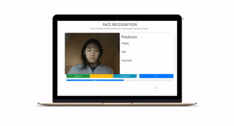

# Emotion-Recognition-with-ML5

Facial Emotion Recognition with ML5: A computer vision project that runs in the browser using ml5.js and TensorFlow.js



* Click on the [video link](https://www.youtube.com/watch?v=onKT9OwMiMU) to see how this wotks!
* [Click here](https://imadtoubal.github.io/Emotion-Recognition-with-ML5/) for demo

## Getting Started

You can simply double click on `index.html` and use the app. Additionally, you can find the main code in `sketch.js`

### Run locally

You can simply open `index.html` in your browser. 

Additionally, you can run a local server. You need to have Python installed in your computer.

1. Run a simple http server using Python's built-in `http.server`:
   
   ```console
   python -m http.server
   ```

2. Open `http://localhost:8000/` in your favorite browser

## Built With

* [p5.js](https://www.tensorflow.org/) - The HTML canvas library used
* [ml5.js](https://www.tensorflow.org/) - The Machine Learning library used
* [clmtrackr](https://github.com/auduno/clmtrackr) - The library used for face tracking

## Authors

* **Imad Eddine Toubal** - *Initial work* - [imadtoubal](https://github.com/imadtoubal)


## License

This project is licensed under the MIT License - see the [LICENSE](LICENSE) file for details

## Acknowledgments

* Inspiration: [ml5.js: Webcam Image Classification](https://thecodingtrain.com/Courses/ml5-beginners-guide/1.2-ml5-webcam-image-classification.html)

 Happy coding!
